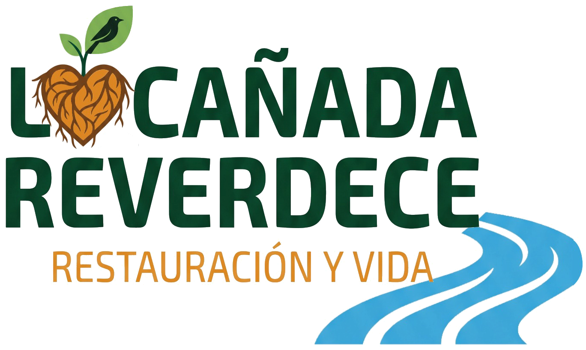

  

<h1 align="center">La Cañada Reverdece</h1>

  <strong>Camine el bosque con quienes lo siembran.</strong> 
  Vereda La Cañada · El Agrado, Huila · Colombia

  <a href="https://huilareverdece.com/">Visite La Cañada Reverdece</a>

## Quiénes somos

La Cañada Reverdece (nombre provisional) presenta el trabajo de una unidad productiva asociativa de la vereda La Cañada, en El Agrado, Huila. Somos familias campesinas que encontramos en el cuidado del territorio una forma de trabajar juntas, compartir lo que sabemos y generar oportunidades para nuestra comunidad.

Nuestro lugar es el Bosque Seco Tropical del alto Magdalena. Aquí producimos plantas para la venta y ofrecemos recorridos guiados para conocer el bosque y las historias del territorio.

## Nuestra historia

Vivimos en la zona de influencia de la hidroeléctrica El Quimbo y hemos visto cómo la transformación del paisaje cambia la vida del territorio. De esa experiencia nacieron dos iniciativas que hoy se encuentran en un mismo lugar: un vivero comunitario de especies nativas y frutales, y un sendero para compartir el bosque, sus aves y sus historias.

El vivero y el sendero se sostienen con el trabajo de varias familias y con decisiones tomadas en comunidad. La producción de plantas y los recorridos son una oportunidad para transmitir el conocimiento de quienes viven aquí.

## Dos maneras de encontrarnos

### Caminar el bosque

Invitamos a conocer La Cañada a través de un recorrido guiado por personas de la vereda. El pasadía de observación de aves permite acercarse al Bosque Seco Tropical, escuchar las historias del lugar y descubrir cómo se relacionan el sendero, el vivero y las áreas en restauración.

La experiencia comienza en el vivero comunitario. Desde allí caminamos el sendero interpretativo y compartimos la observación de aves con binoculares y telescopio. La fecha, los cupos y las condiciones de la visita se acuerdan directamente con la comunidad.

### Comprar plantas del vivero

El vivero se dedica a la producción y venta de plántulas de árboles nativos y frutales. Las propagamos con semilla del territorio para que cada comprador pueda sembrarlas en su terreno. Entre las especies del catálogo están el guayacán, el samán, el guácimo y el gualanday, junto con frutales como el limón, la naranja y el madroño.

Acompañamos la elección de las especies según el lugar de siembra, compartimos indicaciones para su cuidado y ofrecemos seguimiento después de la entrega. La disponibilidad de cada especie, el valor final y las condiciones de entrega se confirman al conversar con nosotros.

## Lo que nos mueve

Nuestra misión es unir la producción de plantas y los recorridos por el bosque con el bienestar de las familias campesinas. Queremos aportar material vegetal y conocimiento a la restauración de nuestra región, mientras construimos una actividad comunitaria que pueda sostenerse en el tiempo.

Nos guían cinco compromisos:

- **Conocer el origen de la semilla:** recolectar en el territorio y reconocer los árboles de los que proviene.
- **Cumplir lo acordado:** hablar con claridad sobre cantidades, tiempos y posibilidades.
- **Trabajar en colectivo:** sostener el vivero y el sendero con la participación de las familias.
- **Asesorar con criterio ecológico:** recomendar especies según las necesidades del lugar.
- **Compartir el conocimiento local:** transmitir lo aprendido al vivir y trabajar en La Cañada.

## Hacia dónde queremos crecer

Nuestra visión hacia 2030 es fortalecer el vivero como proveedor de material vegetal nativo en el sur del Huila y consolidar el sendero como una experiencia estable, acompañada por guías de la vereda. Queremos que más personas conozcan este territorio y que el trabajo comunitario siga encontrando oportunidades en su cuidado.

## Un lugar para conocer nuestro trabajo

Esta página reúne nuestra historia, el recorrido del sendero, las especies del vivero y videos grabados por la comunidad. También permite organizar una consulta: elegir plantas y cantidades, o proponer una fecha y un grupo para la visita.

La conversación continúa en WhatsApp, donde confirmamos la disponibilidad y acordamos los detalles de cada pedido o recorrido.

## Hablemos

**Estamos en la vereda La Cañada, municipio de El Agrado, Huila, Colombia.**

- [WhatsApp: 312 337 3394](https://wa.me/573123373394)
- [Correo: mccpgarzon@gmail.com](mailto:mccpgarzon@gmail.com)
- Proyecto impulsado por [Entropia Popular](https://www.facebook.com/profile.php?id=100069171400785)

**Nos vemos en La Cañada.**
